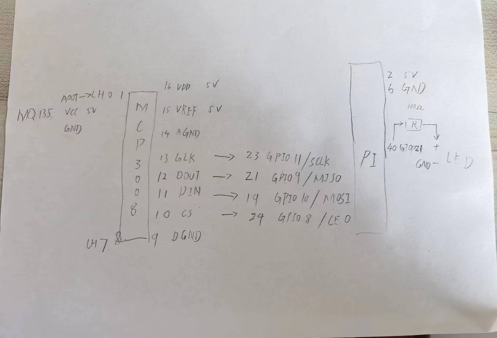

# Raspberrypi Gas Sensor

## 接线图



## 镜像地址

[qiuyin/raspberrypi-gas-sensor:dind](https://hub.docker.com/r/qiuyin/raspberrypi-gas-sensor)

## 使用

```
docker run --device /dev/gpiomem -it --rm raspberrypi-gas-sensor:dind
```